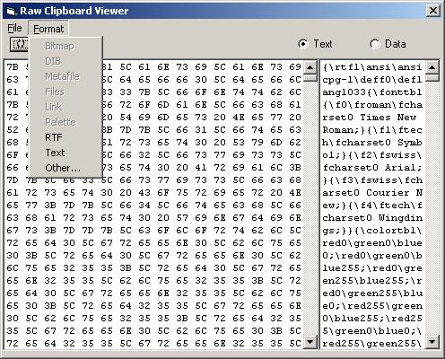



## Raw Clipboard Viewer

### Description

Working on a clip-board spy to understand how data is saved within the clipboard. Still cleaning up a few things - but it works for the most part.
 
### More Info
 

             |
---                |---
**Submitted On**   |2002-03-19 16:13:56
**By**             |[Lewis E\. Moten III](https://github.com/Planet-Source-Code/PSCIndex/blob/master/ByAuthor/lewis-e-moten-iii.md)
**Level**          |Beginner
**User Rating**    |4.8 (19 globes from 4 users)
**Compatibility**  |VB 6\.0
**Category**       |[Complete Applications](https://github.com/Planet-Source-Code/PSCIndex/blob/master/ByCategory/complete-applications__1-27.md)
**World**          |[Visual Basic](https://github.com/Planet-Source-Code/PSCIndex/blob/master/ByWorld/visual-basic.md)
**Archive File**   |[Raw\_Clipbo634783192002\.zip](https://github.com/Planet-Source-Code/lewis-e-moten-iii-raw-clipboard-viewer__1-32841/archive/master.zip)

